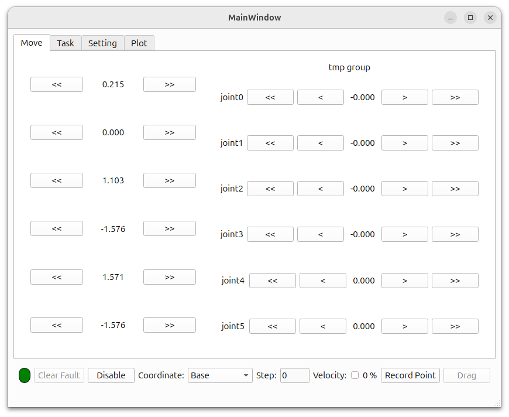
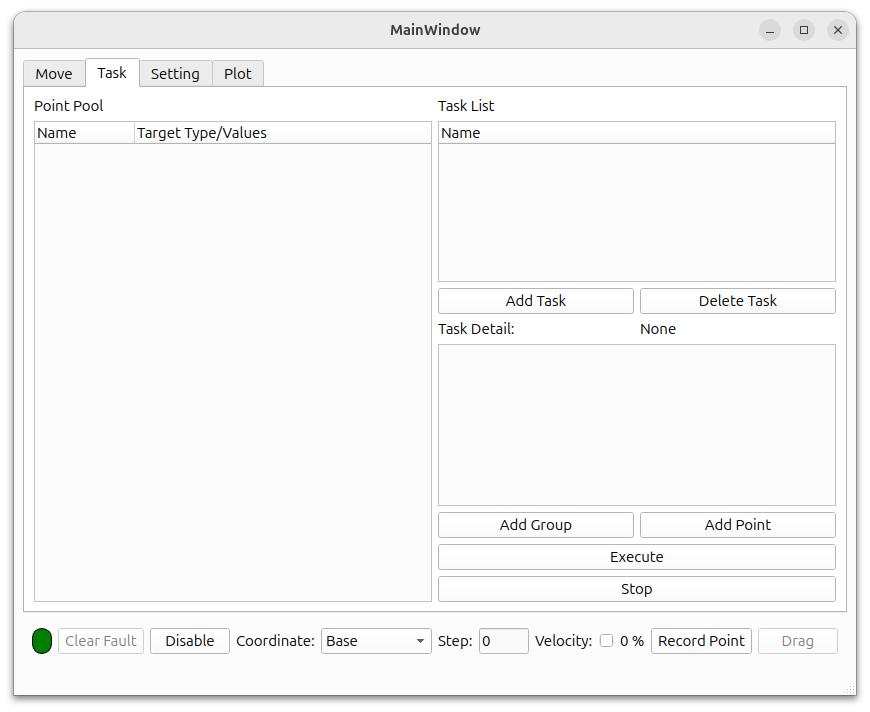
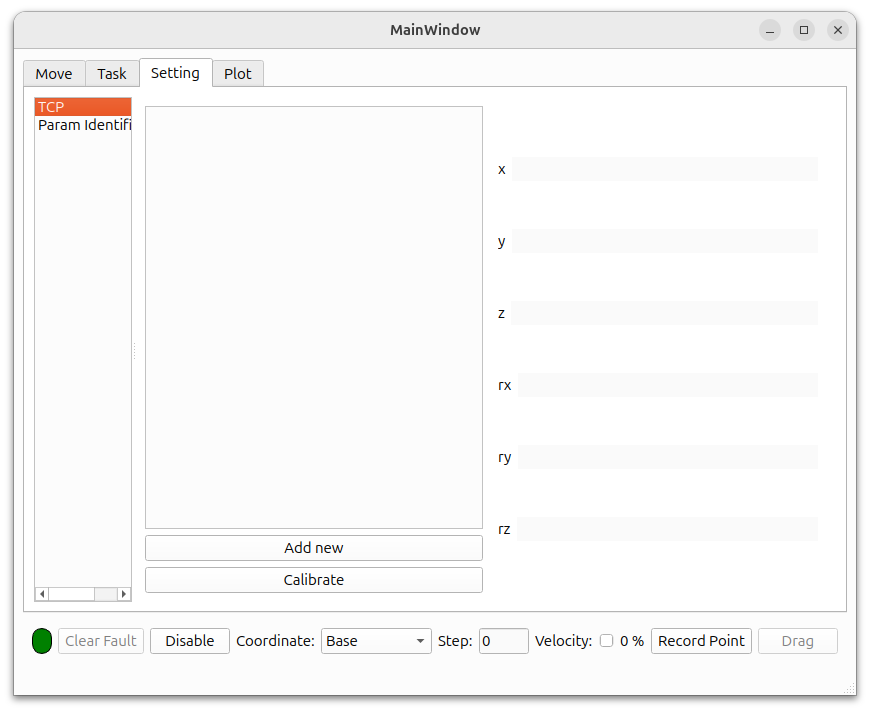
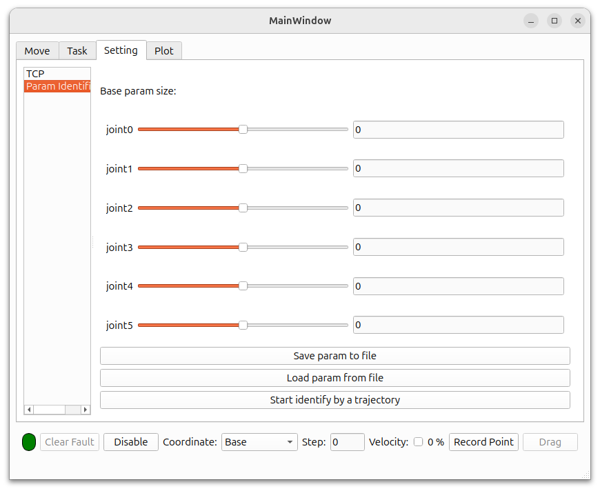
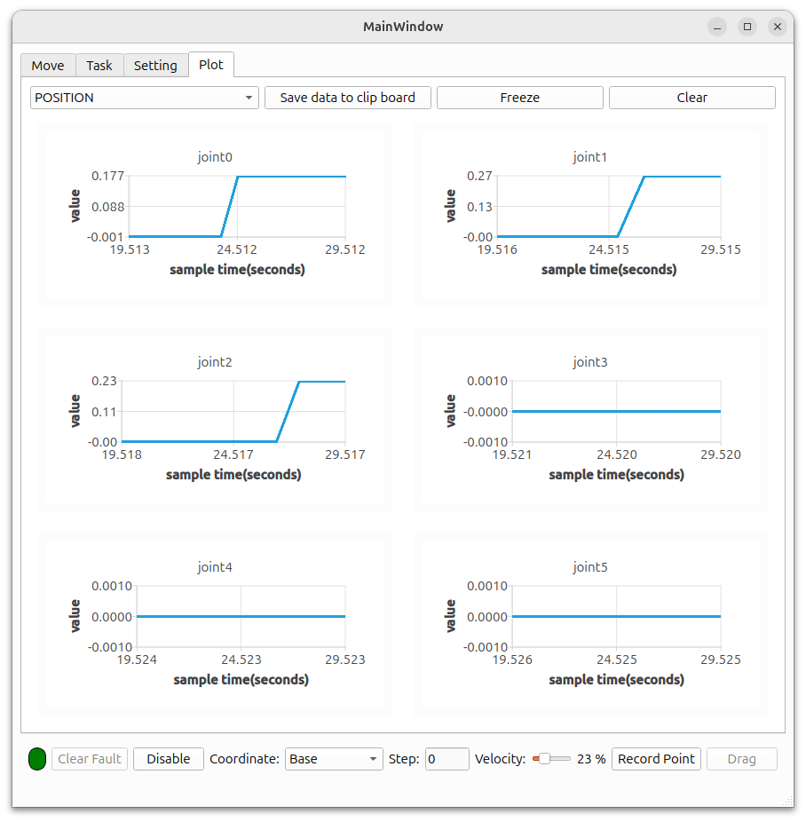

# ROS 2 General Teaching Pendant

This repository provides a general teaching pendant for robotic arms with different kinematic configurations.  
Just plug it in and play.

---

## Dependencies

- Development platform: **ROS 2**  
- Communication with motor drivers: **EtherCAT**  
- EtherCAT master: **IgH**  
- ROS 2 Control hardware interface wrapper: [ethercat_driver_ros2](https://github.com/ICube-Robotics/ethercat_driver_ros2)  
- UI framework: **Qt6**  
- Simulation: **Gazebo**  
- Plot **JKQTPlotter** [installation instruction](https://jkriege2.github.io/JKQtPlotter/page_buildinstructions.html) 

---
## UI Demonstration

### 1.Move


Left side is cartesian motion. Right side is joint motion.
The bottom bar is the controller bar.

### 2. Task


This page can define a task for robot.

### 3. Setting
#### TCP


Set a tool coordinate for robot. You can input tool size or get one by tcp calibration.

#### Parameter identification

**Be careful it could be very dangerous using this. Make sure you know what you're doing and use emergency stop!**

Do robotics dynamic parameter identification. After that, you may drag and teach you robot.

<video width="640" height="360" controls>
  <source src="misc/drag_demo.mp4" type="video/mp4">
</video>

### 4. Plot


Position/Velocity/Acceleration/Effort Graph


---

## Usage

### 1. Install Dependencies
Install all the dependencies listed above.  

---

### 2. Copy A Configuration

Here is a [demo configuration](https://github.com/jintaoChan/ROS2-general-teaching-pendant/tree/dev/src/fake_ur_config). **Be careful with the package name.**

#### Notes
a. **Configure yaml for each motor in your robot** in `/driver_config`. Refer [ethercat_driver_ros2](https://icube-robotics.github.io/ethercat_driver_ros2/) for more information.

b. **Modify `/config/fake_ur_config.ros2_control.xacro`** 

Basically you only need to modify the slaves' position and param file's name.


c. **Substitude your own urdf file**

Fill in the template here and substitude `/config/fake_ur_config.urdf`.


````xml
<?xml version="1.0" encoding="utf-8"?>
<robot name="fake_ur" xmlns:xacro="http://www.ros.org/wiki/xacro">

  <xacro:macro name="fake_ur">
  <!-- add your own urdf here -->
  <link name="world"/>
  <joint name="base_joint" type="fixed">
    <parent link="world"/>
    <child link="base_link"/>
    <origin xyz="0 0 0" rpy="0 0 0"/>
    <axis xyz="0 0 1"/>
  </joint>
  </xacro:macro>
  <gazebo>
    <plugin filename="gz_ros2_control-system" name="gz_ros2_control::GazeboSimROS2ControlPlugin">
      <parameters>$(find fake_ur_config)/config/ros2_controllers.yaml</parameters>
    </plugin>
  </gazebo>
  <xacro:fake_ur/>
</robot>
````

d. Adjust parameters in `/config/grtp.yaml`

Parameter table
- coordinate_system: fix the base/tool/end effector coordinate system which must present in urdf.
- cartesian_limits: cartesian movement limitation.
- drag_params: drag and drop teaching parameters. D for Damping. M for Assistance. **Strongly recommend to set D to 100 and set M to 0 first. Then slowly adjust them to a reasonable value.**


### 3. Run
Replace names with your own config package
```cmd
ros2 launch xxx test.py   # no need to connect to real hardware. It will start with a gazebo
ros2 launch xxx real.py   # real hardware
ros2 run auto_store_ui auto_store_ui # ui
```