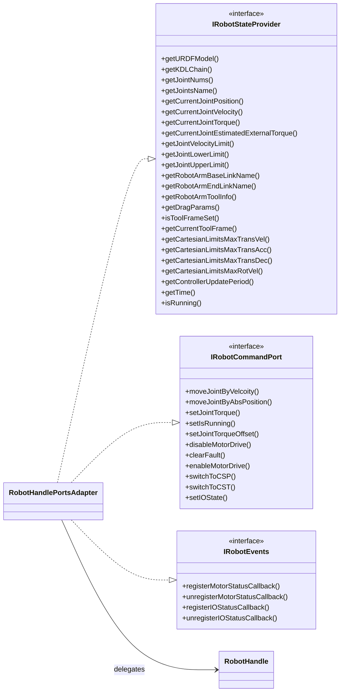

# Control Pad Controller - Phase 1 Interface Introduction

## Scope

Phase 1 introduces interface contracts and an adapter layer only.
No runtime behavior is changed, and existing singleton-based call paths remain valid.

## Added Contracts

- IRobotStateProvider
  - Read-only robot state and limits used by algorithm modules.
- IRobotCommandPort
  - Robot command operations (motion, torque, mode, IO).
- IRobotEvents
  - Callback registration for motor status and IO status events.

Contracts are defined in:
- src/contracts/robot_ports.h

## Added Adapter

- RobotHandlePortsAdapter
  - Implements all three contracts by forwarding calls to an existing RobotHandle instance.
  - Provides a migration bridge so plugin modules can adopt interfaces gradually.

Adapter files:
- src/contracts/robot_handle_ports_adapter.h
- src/contracts/robot_handle_ports_adapter.cpp

## Build Integration

The adapter source and contracts include directory are added to control_pad_controller CMake.

## Architecture Diagram

## What This Enables Next

- Phase 2 can migrate KinematicsPlugin from RobotHandle::instance() to constructor-injected ports.
- Phase 3 can migrate DynamicPlugin similarly.
- This allows testing plugins without requiring global singletons during test setup.
